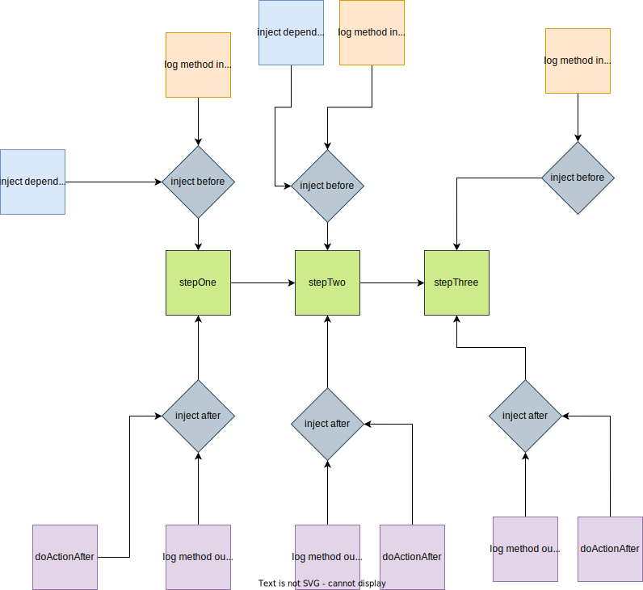

# F-Composer


A nodejs library for composing tiny functions together in a sequential manner

## Installation

```cmd
npm i f-composer
```

## Introduction

This library has a backbone component which is `Workflow`, basically the workflow is a collection of tiny functions are combined together to form a bigger implementation, these tiny functions are called steps, these steps are exeucted in a sequential manner, you can also inject some hooks for each steps to be exeucted before or after the step execution

This library borrows some concepts from functional programming, one of these concepts, each step added to this workflow should have input or output, and each output of the function will be the input for the next one.

## Use Case
- **FP Implementation**: In javascript world you have the ability to write your code in different paradigms, and different ways, one of these paradigms is expressing your code in functions, could be anonymous functions, named functions or arrow functions, using this library you can expose your busines in very small functions and compose them together in workflow to build something bigger that can execute these tiny functions in a sequential manner
- **Decorators**: If you are familiar with OOP world you will be familiar with decorators pattern to attach additional behaviors to your code without affecting the code base, using this library you can do something similar to this pattern, by attaching hooks to the workflow steps you can inject additional behaviors to be executed before or after each step in your workflow
- **Dependency Injection**: The hooks concept in this library could be used to inject things into your functions without affecting these functions or reading things from the global scope
- **Middlewares**: In http routing world, there is a common concept is called middleware which allows you to execute some behaviors without affecting the main context, the problem is, this concept is only used on http layer or router later or controller layer, but doesn't exist on service layer, this library tries to bring this concept to the down layer, which is the service layer, so instead of putting your logic inside a single function or inside a single service, you can start divide the service implementation into smaller functions that could be executed in a sequential manner

## Concept



The concept of workflows is about grouping multiple and related functionalities and compose them in one method, suppose you have a function like place an order as the following:

```typescript
function placeOrder() {
    createOrder()
    doPayment()
    clearCart()
    sendEmail()
}
```

In this example, you see you have a big functionality that knows about everything related to creating and order, doing payment, clearing cart and sending emails, and you are calling these method in a sequence, so instead of calling these methods in that way in a bigger function, you just create a workflow and start adding the steps and the library will compose these functions together

This library aims to help you devide your code into very small, specific functions that do one thing, based on single responsibility principle, this will help you to make your code more testable and extendable


## Usage

This library could be used in typescript or javascript, also can run either on nodejs server or on browser

```typescript
const workflow = Workflow.NewWorkflow();
```

`NewWorkflow` method is used to create new workflow object

Then you can add steps as much as you want, you can add one step using the following method

```typescript
workflow.addStep(step, ...hooks);
```

This method takes endless arguments, the first argument is an object, which represents the actual step that needs to be executed and the rest of arguments are hooks that can be executed `before` or `after` the step execution

**Step Fields**

| field   | value type | required | description                                                         |
|---------|------------|----------|---------------------------------------------------------------------|
| func    | function   | true     | the function that should be executed in this step                   |
| options | object     | false    | this is an optional object contains some configuration for the step |

**Options Object**

| field                 | value type | required | default value | description                                                                                                                                |
|-----------------------|------------|----------|---------------|--------------------------------------------------------------------------------------------------------------------------------------------|
| readFromOriginalInput | boolean    | false    | false         | if sat to true, it will read from the original input not from the output of the previous step                                              |
| defaultReturningInput | boolean    | false    | false         | if sat to true and there is no result returned from this step, the workflow will automatically return the input of this step as its result |

**Here is an example for step object**

```typescript
workflow.addStep({
    func: () => {
        // here is logic for step to be executed
    },
    options: {
        readFromOriginalInput: false,
        defaultReturningInput: false
    }
});
```

**Note**
each step function can return an output, this output will be used to feed the next function input


#### Adding multiple steps in one call

you can add multiple steps in one call using the following method:

```typescript
workflow.addSteps([step, ...hooks], [step, ...hooks]);
```

this method takes endless arguments, each argument should be an array with at least one argument, the first argument is the step that you want to execute, and the other arguments are optional, each one could be an object represents a hook that should be executed before or after executing the actual step, please refer to `addStep` method above

**Note**
the functions are executed sequentially and in FIFO mode, which means the first function registered to this workflow it will be the first one executed

### Building the workflow
After adding steps to the workflow now you need to compose/build the workflow you created, by combining the steps in a series, this is done using a function called `composeAsync`, if you are working with typescript, this function takes a generic type which is the returned type from this workflow

```typescript
workflow.composeAsync<string>();
```

### Hooks

While you can add multiple steps to be executed in a sequence, you can also use something called `hooks` that will be attached to each step in the workflow

Suppose you have the following scenario:

you have three steps, and each step, and each step does specific action and you want to log the input and the output for each step, in this case you can attach hooks which are type of functions that can be executed before executing the step or after executing it

**Example**

```typescript
const workflow = Workflow.NewWorkflow()
const stepOne = () => {
    // do implementation for step one here
}
const stepTwo = () => {
    // do implementation for step two here
}

const loggerHook = (inp) => {
    console.log('=============== logger', inp);
    return inp;
}

workflow.addStep({
    func: stepOne,
}, {
    type: HookType.before,
    func: loggerHook,
})
workflow.addStep({
    func: stepTwo,
}, {
    type: HookType.before,
    func: loggerHook
})
```
Each hook is an object that has multiple fields, `type` which is the hook type, `func` field which is the function that will be executed as a hook, and `options` which is some options to decide the hook behavior

**Step Fields**

| field   | value type | required | description                                                         |
|---------|------------|----------|---------------------------------------------------------------------|
| type    | `before`, `after`, `workflowError`, `stepError`   | true     | the type of the hook to be executed before or after the step execution                   |
| func    | function   | true     | the function that should be executed in this step                   |
| options | object     | false    | this is an optional object contains some configuration for the step |

**Options Object**

| field                 | value type | required | default value | description                                                                                                                                |
|-----------------------|------------|----------|---------------|--------------------------------------------------------------------------------------------------------------------------------------------|
| readFromOriginalInput | boolean    | false    | false         | if sat to true, it will read from the original input not from the output of the previous step                                              |
| defaultReturningInput | boolean    | false    | false         | if sat to true and there is no result returned from this hook, the workflow will automatically return the input of this hook as its result |

**Note the following**

- Hooks with `before` type will change the inputs of the step
- `before` hooks are executed in a sequence with FIFO order before executing the step function
- `after` hooks are executed in setImmediate mode to enable the workflow to execute the rest of steps
- `after` hooks doesn't affect other steps inputs
- `defaultReturningInput` this option doesn't take effect on hooks with `after` type

#### Hooks use cases

you can use hooks to do the following "not limited to":

- do logging before and after the step execution
- do dependency injection before executing the workflow step
- attach additional behaivour with `after` type to the step without affecting the main workflow like sending emails or notifications
- do something like check access permissions or privileges before executing the step function 

## Examples

### Logger Example

This example shows you how to attach a logger before executing the workflow steps and after executing them

```typescript
const workflow = Workflow.NewWorkflow();

const startLoggerStep = (...args: any) => {
    console.log('started executing workflow', args);
    return args;
};

const endLoggerStep = (result: number) => {
    console.log('ending executing workflow', result);
    return result;
};

const add1Step = (num: number): number => {
    return num + 1;
}

const adder1Service = workflow.addStep(startLoggerStep).addStep(add1Step).addStep(endLoggerStep).composeAsync<number>();

(async () => {
    const result = await adder1Service(1)
    console.log(result);
})()

```
